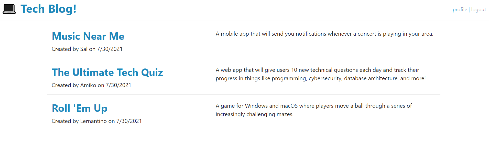
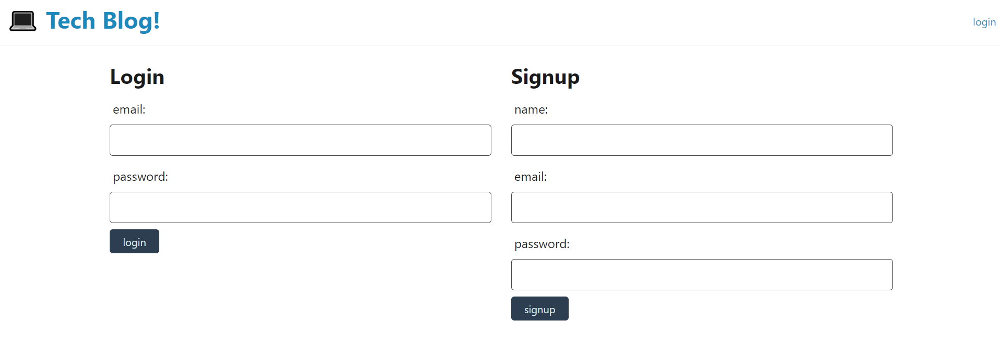
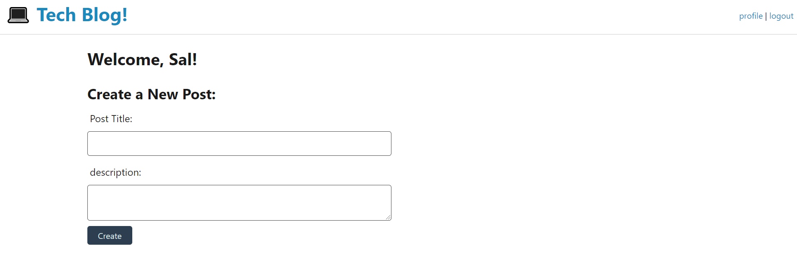
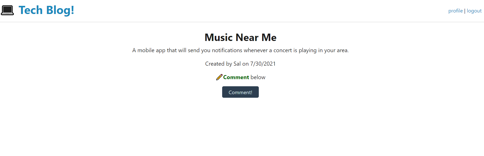

# 14-Model View Controller - Tech Blog

by Jacob Hegan

UWA Full-Flex Bootcamp February 2021

[Heroku Link](https://tech-blog-jh.herokuapp.com/)

[GitHub Repository](https://github.com/heganjr/MVC-tech-blog)

---

[](https://choosealicense.com/licenses/mit/)

---

## Description

A CMS-style blog - Allowing bloggers to post, delete, read blog posts.

## Table of Contents

- [Installation](#installation)
- [Usage](#usage)
- [Screenshots](#screenshot)
- [How To Contribute](#how-to-contribute)
- [Credits](#credits)
- [License](#license)

## Installation

If cloning the repo locally:

npm i

- to install all dependencies found in package.json

- create a .env file with:

DB_NAME=techblogdb
DB_USER=root
DB_PASSWORD=xxxx

npm run seed

- to push seed data to the techblog database

npm start

- to launch the server at https://localhost:3001

... otherwise operate the app through the heroku link

## Usage

```md
AS A developer who writes about tech
I WANT a CMS-style blog site
SO THAT I can publish articles, blog posts, and my thoughts and opinions
```

---

```md
GIVEN a CMS-style blog site
WHEN I visit the site for the first time
THEN I am presented with the homepage, which includes existing blog posts if any have been posted; navigation links for the homepage and the dashboard; and the option to log in
WHEN I click on the homepage option
THEN I am taken to the homepage
WHEN I click on any other links in the navigation
THEN I am prompted to either sign up or sign in
WHEN I choose to sign up
THEN I am prompted to create a username and password
WHEN I click on the sign-up button
THEN my user credentials are saved and I am logged into the site
WHEN I revisit the site at a later time and choose to sign in
THEN I am prompted to enter my username and password
WHEN I am signed in to the site
THEN I see navigation links for the homepage, the dashboard, and the option to log out
WHEN I click on the homepage option in the navigation
THEN I am taken to the homepage and presented with existing blog posts that include the post title and the date created
WHEN I click on an existing blog post
THEN I am presented with the post title, contents, post creator’s username, and date created for that post and have the option to leave a comment
WHEN I enter a comment and click on the submit button while signed in
THEN the comment is saved and the post is updated to display the comment, the comment creator’s username, and the date created
WHEN I click on the dashboard option in the navigation
THEN I am taken to the dashboard and presented with any blog posts I have already created and the option to add a new blog post
WHEN I click on the button to add a new blog post
THEN I am prompted to enter both a title and contents for my blog post
WHEN I click on the button to create a new blog post
THEN the title and contents of my post are saved and I am taken back to an updated dashboard with my new blog post
WHEN I click on one of my existing posts in the dashboard
THEN I am able to delete or update my post and taken back to an updated dashboard
WHEN I click on the logout option in the navigation
THEN I am signed out of the site
WHEN I am idle on the site for more than a set time
THEN I am able to view comments but I am prompted to log in again before I can add, update, or delete comments
```

### Screenshot









## How to Contribute

---

Contributions are not possible.

If there are issues you can contact me through my GitHub profile found in the credits below.

I am happy to take on any suggestions and feedback!

---

## Credits

[hegan.jr](https://github.com/heganjr)

---

## License

[MIT](https://choosealicense.com/licenses/mit/)

MIT License

Copyright (c) [2021] [Jacob Hegan]

Permission is hereby granted, free of charge, to any person obtaining a copy
of this software and associated documentation files (the "Software"), to deal
in the Software without restriction, including without limitation the rights
to use, copy, modify, merge, publish, distribute, sublicense, and/or sell
copies of the Software, and to permit persons to whom the Software is
furnished to do so, subject to the following conditions:

The above copyright notice and this permission notice shall be included in all
copies or substantial portions of the Software.

THE SOFTWARE IS PROVIDED "AS IS", WITHOUT WARRANTY OF ANY KIND, EXPRESS OR
IMPLIED, INCLUDING BUT NOT LIMITED TO THE WARRANTIES OF MERCHANTABILITY,
FITNESS FOR A PARTICULAR PURPOSE AND NONINFRINGEMENT. IN NO EVENT SHALL THE
AUTHORS OR COPYRIGHT HOLDERS BE LIABLE FOR ANY CLAIM, DAMAGES OR OTHER
LIABILITY, WHETHER IN AN ACTION OF CONTRACT, TORT OR OTHERWISE, ARISING FROM,
OUT OF OR IN CONNECTION WITH THE SOFTWARE OR THE USE OR OTHER DEALINGS IN THE
SOFTWARE.

---

END
